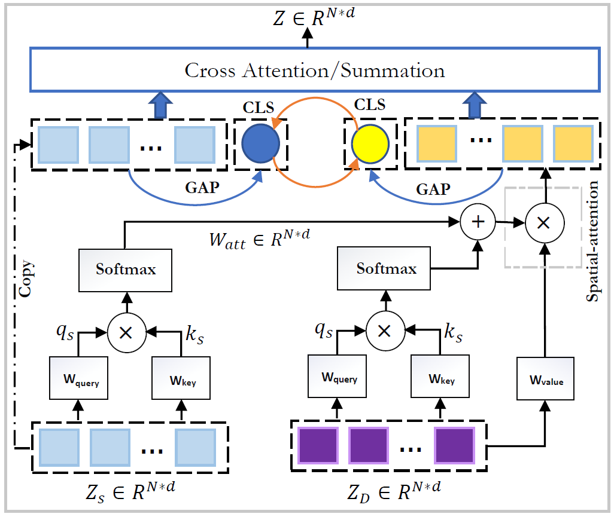

# AttSwinUnet
Official implementation code for [_Attention Swin U-Net: Cross-Contextual Attention Mechanism for Skin Lesion Segmentation_]() paper

---
:fire: __The code will be released after the acceptance of the paper.__

---

## Updates
- October 23, 2022: Submitted to ISBI2023 [Under Review].
---
